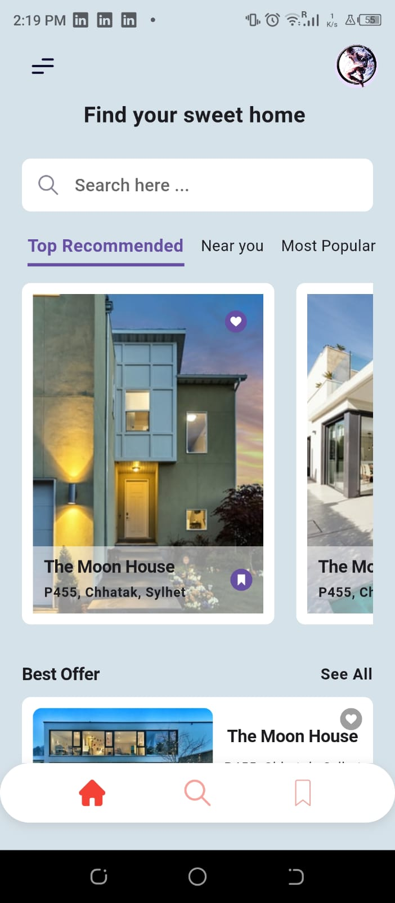

# house_reservation

A new Flutter project.

## Description

The House Reservation App is a Flutter-based application designed to simplify the process of reserving houses or accommodations. The app provides users with an intuitive interface to browse available houses, check their details, and make reservations seamlessly.

This repository contains the source code of the House Reservation App. Feel free to explore, contribute, and use it according to the license.

## Features

- Browse through a list of available houses with images and descriptions.
- View detailed information about each house, including amenities, location, and pricing.
- Select check-in and check-out dates to see availability and calculate the total cost.
- User authentication and profile management.
- After choosing the house you can contact the owner for the reservation

 ## Screenshots

 

